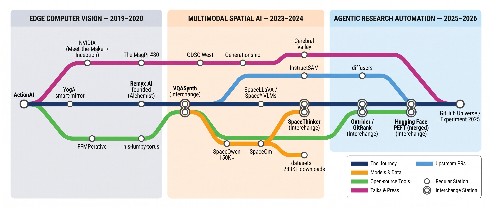

# Terry Rodriguez

**Co-founder & CTO, [Remyx AI](https://remyx.ai)** — experiment orchestration for AI teams.

Open source contributions across **spatial-reasoning VLMs**, **agentic research automation**, generative & multimodal AI, computer vision, robotics, and ML infrastructure.

---

  
   <b>The journey</b> — from edge computer vision to agentic research automation (2019 → 2026)

### 📊 By the numbers
🤗 **283K+ downloads** across **70+ open models & datasets** ([@remyxai](https://huggingface.co/remyxai) — 21 models · 50 datasets)  ·  ⭐ **1.4K+ GitHub stars** across open-source projects

<table>
<tr>
<td width="50%"> <b>ActionAI</b> — real-time activity recognition from body keypoints, on the edge</td>
<td width="50%"> <b>nls-lumpy-torus</b> — mass-critical collapse on a curved manifold, from the spectral-geometry gallery</td>
</tr>
</table>

## ⚙️ The engines

**[VQASynth](https://github.com/remyxai/VQASynth)** — the open pipeline that turns raw images into spatial-reasoning datasets: CLIP retrieval → RAM/LLaVA captions → GroundingDINO/CLIPSeg → SAM → ZoeDepth → RANSAC planes.

**[Outrider](https://github.com/remyxai/outrider)** — brief-to-PR research automation: arXiv → rank & license-enrich → select & preflight gates → draft → fidelity / convention / test audits → PR, with automated + human refinement loops and full run telemetry.

## 🛰️ Open models & datasets
Fine-tuned VLMs for quantitative **spatial reasoning** (distances, sizes, directions — for robotics & embodied AI) and the synthetic-data pipelines that train them.

- **[SpaceQwen2.5-VL-3B](https://huggingface.co/remyxai/SpaceQwen2.5-VL-3B-Instruct)** — grounded spatial VQA · **150K+ downloads**, the flagship
- **[SpaceThinker-Qwen2.5VL-3B](https://huggingface.co/remyxai/SpaceThinker-Qwen2.5VL-3B)** — a *reasoning* spatial VLM (test-time compute) · 30K+ downloads
- **[SpaceOm](https://huggingface.co/remyxai/SpaceOm)** · **[SpaceLLaVA (13B)](https://huggingface.co/remyxai/SpaceLLaVA)** · **SpaceMantis** · **SpaceQwen3-VL-2B-Thinking**
- **Datasets:** SpaceThinker · Robo2VLM-Reasoning · OpenSpaces · SpaceJudge — spatial VQA + reasoning traces

> 🗣️ The **SpatialVLM** research community credited **remyxai** for the open-source data-synthesis pipeline behind these models.

## 🛠️ Open-source projects
 — real-time spatio-temporal activity recognition from body keypoints; runs on Jetson-class edge devices.

 — compose multimodal spatial-reasoning datasets from raw images. 🎹

 — chat to compose video. 

 — a **brief-to-PR** research harness: scouts arXiv for a codebase and drafts *testable* implementations into existing call sites. ([demo ▶️](https://www.youtube.com/watch?v=N_FNfZ71s2I))

 — a spectral-geometry NLS/Gross–Pitaevskii solver + a gallery of numerical experiments (solitons, analog gravity & cosmology, quantum chaos, topological & Floquet transport), packaged as an **MCP toolkit for verification-grounded agent inference**.

## 🔀 Recent upstream contributions
Often drafted with **Outrider**, then verified and refined:
- **[huggingface/peft](https://github.com/huggingface/peft/pull/3382)** — *Riemannian-preconditioned LoRA optimizer* (**merged** ✅)
- **[DCDmllm/InstructSAM](https://github.com/DCDmllm/InstructSAM/pull/4)** — inference fix + native C++/ggml runtime docs (**merged** ✅)
- in flight toward **diffusers** (a training-free 4K FLUX community pipeline), **LeRobot**, and **TRL**

## 📣 Talks, events & media
- 🏆 **Awards:** [#TFWorld TF 2.0 Challenge — **Winner**](https://devpost.com/software/everybody-dance-faster) (*Everybody Dance Faster* — real-time motion-transfer booth, EdgeTPU + TF 2.0) · [NVIDIA AI-at-the-Edge Challenge — **2nd prize**](https://www.hackster.io/smellslikeml/saving-bandwidth-with-anomaly-detection-16eb67) (*Saving Bandwidth with Anomaly Detection*)
- 🎪 **Hosted:** [Experiment 2025](https://experiment.remyx.ai/) — Remyx's inaugural event, [hundreds in attendance](https://luma.com/experiment-2025)
- 🎤 **Conferences (2024–2025):** [ODSC West 2024](https://odsc.com/blog/speaker/terry-rodriguez/) (*LLMOps & MLOps* track) · GitHub Universe · AI Agent Builders Summit — SF
- 🎙️ **Podcasts:** Generationship (Heavybit) — [Ep. 20 *Smells Like ML*](https://www.heavybit.com/library/podcasts/generationship/ep-20-smells-like-ml-with-salma-mayorquin-and-terry-rodriguez-of-remyx-ai) & [Ep. 40 *ExperimentOps*](https://www.heavybit.com/library/podcasts/generationship/ep-40-experimentops-with-salma-mayorquin-of-remyx-ai) · [Adventures in ML (ML-149)](https://topenddevs.com/podcasts/adventures-in-machine-learning/adaptive-industry-ml-challenges-automation-and-model-applications-ml-149) · Code & Caffeine
- 📰 **Press & features:** [NVIDIA “Meet the Maker”](https://blogs.nvidia.com/blog/smells-like-ml/) spotlight · [The MagPi #80](https://www.raspberrypi.com/news/yoga-training-with-yogai-and-a-raspberry-pi-smart-mirror-the-magpi-issue-80/) (*YogAI* smart mirror) · [Cerebral Valley](https://cerebralvalley.ai/blog/remyx-your-ai-production-assistant-3tNSKSCJzRp6LbSxMCjLed) (founder interview) · [NVIDIA “AI at the Edge”](https://news.developer.nvidia.com/ai-at-the-edge-challenge-spotlight-saving-bandwidth-with-anomaly-detection/) spotlight · *SpatialVLM* community shout-out
- ▶️ **Demo:** [GitRank — Research to Testable PRs in Minutes](https://www.youtube.com/watch?v=N_FNfZ71s2I)

## 🧭 Background
10+ years building production ML — **Riot Games, Tubi, Robust.AI, Remyx**. Mathematics at **UC Berkeley** & **UNC Chapel Hill**.
**Remyx AI** is an [**Alchemist Accelerator**](https://www.alchemistaccelerator.com/) company (investors include Generationship & Roble Ventures).

## 🔗 Connect
[remyx.ai](https://remyx.ai) · [🤗 remyxai](https://huggingface.co/remyxai) · [Docker Hub](https://hub.docker.com/u/remyxai) · [smellslike.ml](https://smellslike.ml) · [Substack](https://remyxai.substack.com/) · [Hackster](https://www.hackster.io/terry-rodriguez) · [YouTube](https://www.youtube.com/watch?v=N_FNfZ71s2I) · [Discord](https://discord.com/invite/b2yGuCNpuC) · [X](https://x.com/smellslikeml) · [LinkedIn](https://www.linkedin.com/in/terry-j-rodriguez/) · [Reddit](https://www.reddit.com/user/remyxai/)
